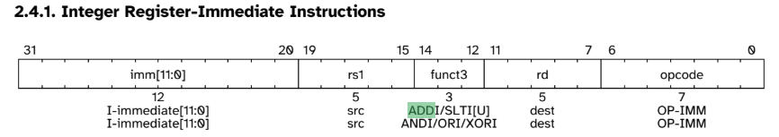
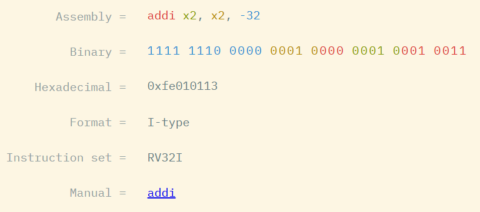

# RustでRISC-Vエミュレータを作成してxv6を動かす

第45回 自作OSもくもく会オンライン！
2025-05-31
フルカワ @kftamang

---
# 自己紹介

- 実験物理→国産組み込みOS開発→自動運転ソフトウェア開発
- コンピューターの低レイヤーが好きです
    - ブラックボックスの中身が見える感
- 組み込みOS開発では顧客環境向けにOSをポーティング
    - 職人（自分）が真心こめてカーネルページテーブルを作成…

---
# 余談
カーネルページテーブルがうまくできないとどうなるか？

1. MMUを有効化する
2. 次の命令をフェッチしようとする
3. ページテーブルが壊れているので例外発生
4. プログラムカウンタが割り込みベクターに設定される
5. これも仮想アドレスのためまた例外発生
6. 4に戻る

という滅多に見ないレベルの壊れ方をします

---
# エミュレータを作るモチベーション

- CPUの理解
    - 雰囲気でしかCPUを使っていない
    - 理解するには作るしかない
- Rustの練習
    - 雰囲気でしかRustを使っていない
    - 習得するには作るしかない

→RustでCPUエミュレータを作ろう
→どうせなら最近アツい **RISC-V** を作ろう

---
# RISC-Vとは

- オープンなISA(Instruction Set Architecture)
- RISCなのでエミュレータ作りやすい
- 規格書がオープンかつコンパクト
    - Volume1,2合わせて1000ページくらい
    - Armは1万ページくらいある（前職で読んでた）
- とにかく最近アツい（らしい）
    - 輸入規制のため中国で利用が盛んだとか（廉価ノイキャンイヤホンに入ってたり）
    - 乗るしかない、このビッグウェーブ


---
# CPUの動作

1. Fetch
    - メモリにアクセスして命令(32bit)を持ってくる
2. Decode
    - 規則に従って解釈する
3. Execute
    - 実行する

---
# Fetch

- プログラムカウンタが指すメモリアドレスから32bitのデータを読み出す
- メモリはVector(ほぼ配列として使用)で実装
- MMUを有効化した後は仮想アドレスを指すため、仮想→物理アドレス変換を行う必要がある

---
# Decode/Execute

- 読みだしたデータをISAに従って解釈する
    
- レジスタなどに対して該当処理を実行する
    ```rust
    pub struct Cpu {
        pub regs: [u64; 32],
        pub pc: u64,
        pub bus: Bus,
        pub csr: Csr,
    }
    ```

---
# xv6の逆アセンブル例
```
struct proc* myproc(void){
    80002498:	fe010113    addi         sp,sp,-32
    <アドレス>   <バイナリ>  <ニーモニック> <オペランド(rs1,rd,immidiate)>
```


---
# 実際のコード

```rust
    pub fn execute(&mut self, inst: u32) -> Result<(), Exception> {
        let opcode = inst & 0x7f;
        let rd = ((inst >> 7) & 0x1f) as usize;
        let rs1 = ((inst >> 15) & 0x1f) as usize;
        let funct3 = ((inst >> 12) & 0x7) as usize;
        match opcode {
            0x13 => {
                let imm = (inst as i32 as i64 >> 20) as u64;
                match funct3 {
                    0x0 => {
                        self.regs[rd] = self.regs[rs1].wrapping_add(imm);
                    }
                    _ => return Err(Exception::IllegalInstruction(inst));
                }
                Ok(())
            }
        }
    }
```

これが800行くらい

---
# 便利なサイト



https://luplab.gitlab.io/rvcodecjs/#q=fe010113&abi=false&isa=AUTO


---
# xv6を動かすために必要な機能

1. トラップ
    1. 割り込み
    2. 例外 (仮想→物理アドレス変換でも必要)
2. ペリフェラル
    1. UART
    2. Timer(厳密にはCSRで実装)
    3. PLIC　←実装中
    4. virtio(ストレージ)

---

# デバッガの接続

- デバッグがつらい
- エミュレーション対象のバイナリにGDBを接続
- ステップ実行やブレークポイント設定などが可能
- 実演

---
# ここまでの感想

- CPUの雰囲気がなんとなくわかってきた
- デバッグのためのジグ設計
    - GDBとログの両輪
- 再現性大切
    - バグは再現できれば半分解決
    - 内部状態を再現可能に設計変更
- おれたちの冒険はまだ終わらない
    - xv6を動かす
    - Linuxを動かす